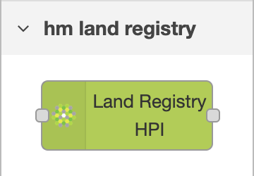
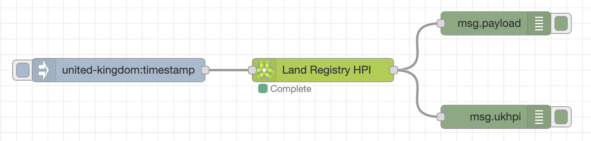

# node-red-contrib-hm-land-registry-hpi

This module provides a node in Node-RED to quickly retrieve HM Land Regsitry UK House Price Index data via the Open Data service

The node requires node.js version 12 or more recent, and has been tested with version 18.4.0

For the latest updates see the [CHANGELOG.md](https://github.com/bikerpatch/node-red-contrib-hm-land-registry-hpi/blob/main/CHANGELOG.md)

## Pre-requisites

This plugin requires [Node-RED](https://nodered.org) to be installed, and has been tested with Node-RED version 2.2.2.  Earlier versions may also be supported, but have not yet been tested.

## Install

You can install either through the Node-RED palette settings or by the following command

    npm i --unsafe-perm @bikerpatch/node-red-contrib-hm-land-registry-hpi

## Usage

There is 1 new node which is added to the `hm land registry` category

### Capability: Land Registry HPI

The `Land Registry HPI` capability allows the flow designer to retrieve UK HPI data from the [HM Land Registry Open Data](https://landregistry.data.gov.uk/) initiative.

The node uses the [Linked Data API](https://landregistry.data.gov.uk/def/ukhpi)

#### Parameters

| Configuration Parameter      | msg parameter | Description | Data Type | Required | Default | Example |
| ----------- | ----------- | ----------- | ----------- | ----------- | ----------- | ----------- |
| Region      | msg.region | [Linked Data API Definition](https://landregistry.data.gov.uk/def/ukhpi/refRegion).  See [Regions](#Regions) for a more complete list of possible values | string | **Required** | *n/a* | united-kingdom |
| Period From   | msg.periodFrom  | Minimum value of the period start date.  [Linked Data API Definition](https://landregistry.data.gov.uk/def/ukhpi/refPeriodStart) | string (format yyyy-mm-dd) | Optional | *6 months ago* | 2020-07-30 |
| Period To   | msg.periodTo  | Maximum value of the period start date.  [Linked Data API Definition](https://landregistry.data.gov.uk/def/ukhpi/refPeriodStart) | string (format yyyy-mm-dd)| Optional | *today's date* | 2022-12-31 |
| Page Number   | msg.page  | In a paged response of data, this is the page index of data to retrieve (first page is index 0) | integer | Optional | 0 | 0 |
| Page Size   | msg.pageSize  | In a paged response of data, this is the size of data per page to retrieve | integer | Optional | 200 | 200 |
| View  | msg.view  | The view of data to retrieve.  Possible values: `all` / `basic` / `description` / `detail` / `labeledDescribeViewer` / `none` | string | Optional | basic | basic |
| Properties  | msg.properties  | Array list of data properties to retrieve when the `basic` view is set. [Linked Data API Definition](https://landregistry.data.gov.uk/def/ukhpi) | string | Optional | [housePriceIndex](https://landregistry.data.gov.uk/def/ukhpi/housePriceIndex), [refMonth](https://landregistry.data.gov.uk/def/ukhpi/refMonth), [refPeriodStart](https://landregistry.data.gov.uk/def/ukhpi/refPeriodStart), [refPeriodDuration](https://landregistry.data.gov.uk/def/ukhpi/refPeriodDuration), [salesVolume](https://landregistry.data.gov.uk/def/ukhpi/salesVolume), [averagePrice](https://landregistry.data.gov.uk/def/ukhpi/averagePrice) | `[ "housePriceIndex", "refMonth","refPeriodStart", "refPeriodDuration", "salesVolume", "averagePrice"]` |

#### Outputs

The following is an example of a successful `msg.payload` paged output, which is copied from `msg.ukhpi.data.result.items`:

  
Click to expand

    [
        {
            "_about": "http://landregistry.data.gov.uk/data/ukhpi/region/united-kingdom/month/2022-04",
            "averagePrice": 281161,
            "housePriceIndex": 147.46,
            "refMonth": "2022-04",
            "refPeriodDuration": 1,
            "refPeriodStart": "Fri, 01 Apr 2022",
            "type": [
                "http://landregistry.data.gov.uk/def/ukhpi/MonthlyIndicesByRegion",
                "http://purl.org/linked-data/cube#Observation"
            ]
        },
        {
            "_about": "http://landregistry.data.gov.uk/data/ukhpi/region/united-kingdom/month/2022-03",
            "averagePrice": 278215,
            "housePriceIndex": 145.92,
            "refMonth": "2022-03",
            "refPeriodDuration": 1,
            "refPeriodStart": "Tue, 01 Mar 2022",
            "type": [
                "http://landregistry.data.gov.uk/def/ukhpi/MonthlyIndicesByRegion",
                "http://purl.org/linked-data/cube#Observation"
            ]
        },
        {
            "_about": "http://landregistry.data.gov.uk/data/ukhpi/region/united-kingdom/month/2022-02",
            "averagePrice": 276609,
            "housePriceIndex": 145.08,
            "refMonth": "2022-02",
            "refPeriodDuration": 1,
            "refPeriodStart": "Tue, 01 Feb 2022",
            "salesVolume": 55183,
            "type": [
                "http://landregistry.data.gov.uk/def/ukhpi/MonthlyIndicesByRegion",
                "http://purl.org/linked-data/cube#Observation"
            ]
        },
        {
            "_about": "http://landregistry.data.gov.uk/data/ukhpi/region/united-kingdom/month/2022-01",
            "averagePrice": 274171,
            "housePriceIndex": 143.8,
            "refMonth": "2022-01",
            "refPeriodDuration": 1,
            "refPeriodStart": "Sat, 01 Jan 2022",
            "salesVolume": 46831,
            "type": [
                "http://landregistry.data.gov.uk/def/ukhpi/MonthlyIndicesByRegion",
                "http://purl.org/linked-data/cube#Observation"
            ]
        }
    ]

The following is an example of a successful `msg.ukhpi` output, where `msg.ukhpi.data.result` includes paging data:

  
Click to expand

    {
        "status": 200,
        "statusText": "OK",
        "headers": {...},
        "config": {...},
        "request": {...},
        "data": {
            "format": "linked-data-api",
            "version": "0.2",
            "result": {
                "_about": "https://landregistry.data.gov.uk/data/ukhpi/region/united-kingdom.json?_pageSize=200&_page=0&min-refPeriodStart=2021-12-26&_view=basic&max-refPeriodStart=&_properties=housePriceIndex,refMonth,refPeriodStart,refPeriodDuration,salesVolume,averagePrice,",
                "definition": "https://landregistry.data.gov.uk/meta/data/ukhpi/region/_regionName.json?min-refPeriodStart=2021-12-26&_view=basic&max-refPeriodStart=&_properties=housePriceIndex,refMonth,refPeriodStart,refPeriodDuration,salesVolume,averagePrice,",
                "extendedMetadataVersion": "https://landregistry.data.gov.uk/data/ukhpi/region/united-kingdom.json?_pageSize=200&_page=0&min-refPeriodStart=2021-12-26&_view=basic&max-refPeriodStart=&_properties=housePriceIndex,refMonth,refPeriodStart,refPeriodDuration,salesVolume,averagePrice,&_metadata=all",
                "first": "https://landregistry.data.gov.uk/data/ukhpi/region/united-kingdom.json?_pageSize=200&_page=0&min-refPeriodStart=2021-12-26&_view=basic&max-refPeriodStart=&_properties=housePriceIndex,refMonth,refPeriodStart,refPeriodDuration,salesVolume,averagePrice,",
                "isPartOf": {
                    "_about": "https://landregistry.data.gov.uk/data/ukhpi/region/united-kingdom.json?min-refPeriodStart=2021-12-26&_view=basic&max-refPeriodStart=&_properties=housePriceIndex,refMonth,refPeriodStart,refPeriodDuration,salesVolume,averagePrice,",
                    "definition": "https://landregistry.data.gov.uk/meta/data/ukhpi/region/_regionName.json?min-refPeriodStart=2021-12-26&_view=basic&max-refPeriodStart=&_properties=housePriceIndex,refMonth,refPeriodStart,refPeriodDuration,salesVolume,averagePrice,",
                    "hasPart": "https://landregistry.data.gov.uk/data/ukhpi/region/united-kingdom.json?_pageSize=200&_page=0&min-refPeriodStart=2021-12-26&_view=basic&max-refPeriodStart=&_properties=housePriceIndex,refMonth,refPeriodStart,refPeriodDuration,salesVolume,averagePrice,",
                    "type": [
                        "http://purl.org/linked-data/api/vocab#ListEndpoint"
                    ]
                },
                "items": [
                    {
                        "_about": "http://landregistry.data.gov.uk/data/ukhpi/region/united-kingdom/month/2022-04",
                        "averagePrice": 281161,
                        "housePriceIndex": 147.46,
                        "refMonth": "2022-04",
                        "refPeriodDuration": 1,
                        "refPeriodStart": "Fri, 01 Apr 2022",
                        "type": [
                            "http://landregistry.data.gov.uk/def/ukhpi/MonthlyIndicesByRegion",
                            "http://purl.org/linked-data/cube#Observation"
                        ]
                    },
                    {
                        "_about": "http://landregistry.data.gov.uk/data/ukhpi/region/united-kingdom/month/2022-03",
                        "averagePrice": 278215,
                        "housePriceIndex": 145.92,
                        "refMonth": "2022-03",
                        "refPeriodDuration": 1,
                        "refPeriodStart": "Tue, 01 Mar 2022",
                        "type": [
                            "http://landregistry.data.gov.uk/def/ukhpi/MonthlyIndicesByRegion",
                            "http://purl.org/linked-data/cube#Observation"
                        ]
                    },
                    {
                        "_about": "http://landregistry.data.gov.uk/data/ukhpi/region/united-kingdom/month/2022-02",
                        "averagePrice": 276609,
                        "housePriceIndex": 145.08,
                        "refMonth": "2022-02",
                        "refPeriodDuration": 1,
                        "refPeriodStart": "Tue, 01 Feb 2022",
                        "salesVolume": 55183,
                        "type": [
                            "http://landregistry.data.gov.uk/def/ukhpi/MonthlyIndicesByRegion",
                            "http://purl.org/linked-data/cube#Observation"
                        ]
                    },
                    {
                        "_about": "http://landregistry.data.gov.uk/data/ukhpi/region/united-kingdom/month/2022-01",
                        "averagePrice": 274171,
                        "housePriceIndex": 143.8,
                        "refMonth": "2022-01",
                        "refPeriodDuration": 1,
                        "refPeriodStart": "Sat, 01 Jan 2022",
                        "salesVolume": 46831,
                        "type": [
                            "http://landregistry.data.gov.uk/def/ukhpi/MonthlyIndicesByRegion",
                            "http://purl.org/linked-data/cube#Observation"
                        ]
                    }
                ],
                "itemsPerPage": 200,
                "page": 0,
                "startIndex": 1,
                "totalResults": 4,
                "type": [
                    "http://purl.org/linked-data/api/vocab#Page"
                ]
            }
        }
    }

### Flow Examples

For examples of how to use, see the [provided example flow](https://github.com/bikerpatch/node-red-contrib-hm-land-registry-hpi/tree/main/examples)

### Regions

The list of valid region values are as follows:

#### Country Regions

* england
* england-and-wales
* great-britain
* northern-ireland
* scotland
* united-kingdom
* wales

#### General Regions

* east-midlands
* east-of-england
* north-east
* north-west
* south-east
* south-west
* west-midlands

#### Islands

* isle-of-anglesey
* isle-of-wight
* orkney-islands

#### Council Areas and Districts

  
Click to expand

* aberdeenshire
* adur
* allerdale
* amber-valley
* angus
* antrim-and-newtownabbey
* argyll-and-bute
* armagh-banbridge-and-craigavon
* arun
* ashfield
* ashford
* babergh
* barking-and-dagenham
* barnet
* barnsley
* barrow-in-furness
* basildon
* basingstoke-and-deane
* bassetlaw
* bath-and-north-east-somerset
* bedford
* belfast
* bexley
* birmingham
* blaby
* blackburn-with-darwen
* blackpool
* blaenau-gwent
* bolsover
* bolton
* boston
* bournemouth-christchurch-and-poole
* bracknell-forest
* bradford
* braintree
* breckland
* brent
* brentwood
* bridgend
* brighton-and-hove
* broadland
* bromley
* bromsgrove
* broxbourne
* broxtowe
* buckinghamshire
* burnley
* bury
* caerphilly
* calderdale
* cambridge
* cambridgeshire
* camden
* cannock-chase
* canterbury
* cardiff
* carlisle
* carmarthenshire
* castle-point
* causeway-coast-and-glens
* central-bedfordshire
* ceredigion
* charnwood
* chelmsford
* cheltenham
* cherwell
* cheshire-east
* cheshire-west-and-chester
* chesterfield
* chichester
* chorley
* city-of-aberdeen
* city-of-bristol
* city-of-derby
* city-of-dundee
* city-of-edinburgh
* city-of-glasgow
* city-of-kingston-upon-hull
* city-of-london
* city-of-nottingham
* city-of-peterborough
* city-of-plymouth
* city-of-westminster
* clackmannanshire
* colchester
* conwy
* copeland
* cornwall
* cotswold
* county-durham
* coventry
* craven
* crawley
* croydon
* cumbria
* dacorum
* darlington
* dartford
* denbighshire
* derbyshire
* derbyshire-dales
* derry-and-strabane
* devon
* doncaster
* dorset
* dover
* dudley
* dumfries-and-galloway
* ealing
* east-ayrshire
* east-cambridgeshire
* east-devon
* east-dunbartonshire
* east-hampshire
* east-hertfordshire
* east-lindsey
* east-lothian
* east-renfrewshire
* east-riding-of-yorkshire
* east-staffordshire
* east-suffolk
* east-sussex
* eastbourne
* eastleigh
* eden
* elmbridge
* enfield
* epping-forest
* epsom-and-ewell
* erewash
* essex
* exeter
* falkirk
* fareham
* fenland
* fermanagh-and-omagh
* fife
* flintshire
* forest-of-dean
* fylde
* gateshead
* gedling
* gloucester
* gloucestershire
* gosport
* gravesham
* great-yarmouth
* greater-manchester
* greenwich
* guildford
* gwynedd
* hackney
* halton
* hambleton
* hammersmith-and-fulham
* hampshire
* harborough
* haringey
* harlow
* harrogate
* harrow
* hart
* hartlepool
* hastings
* havant
* havering
* herefordshire
* hertfordshire
* hertsmere
* high-peak
* highland
* hillingdon
* hinckley-and-bosworth
* horsham
* hounslow
* huntingdonshire
* hyndburn
* inner-london
* inverclyde
* ipswich
* islington
* kensington-and-chelsea
* kent
* king's-lynn-and-west-norfolk
* kingston-upon-thames
* kirklees
* knowsley
* lambeth
* lancashire
* lancaster
* leeds
* leicester
* leicestershire
* lewes
* lewisham
* lichfield
* lincoln
* lincolnshire
* lisburn-and-castlereagh
* liverpool
* london
* luton
* maidstone
* maldon
* malvern-hills
* manchester
* mansfield
* medway
* melton
* mendip
* merseyside
* merthyr-tydfil
* merton
* mid-and-east-antrim
* mid-devon
* mid-suffolk
* mid-sussex
* mid-ulster
* middlesbrough
* midlothian
* milton-keynes
* mole-valley
* monmouthshire
* moray
* na-h-eileanan-siar
* neath-port-talbot
* new-forest
* newark-and-sherwood
* newcastle-under-lyme
* newcastle-upon-tyne
* newham
* newport
* newry-mourne-and-down
* norfolk
* north-ayrshire
* north-devon
* north-down-and-ards
* north-east-derbyshire
* north-east-lincolnshire
* north-hertfordshire
* north-kesteven
* north-lanarkshire
* north-lincolnshire
* north-norfolk
* north-northamptonshire
* north-somerset
* north-tyneside
* north-warwickshire
* north-west-leicestershire
* north-yorkshire
* northumberland
* norwich
* nottinghamshire
* nuneaton-and-bedworth
* oadby-and-wigston
* oldham
* outer-london
* oxford
* oxfordshire
* pembrokeshire
* pendle
* perth-and-kinross
* portsmouth
* powys
* preston
* reading
* redbridge
* redcar-and-cleveland
* redditch
* reigate-and-banstead
* renfrewshire
* rhondda-cynon-taf
* ribble-valley
* richmond-upon-thames
* richmondshire
* rochdale
* rochford
* rossendale
* rother
* rotherham
* rugby
* runnymede
* rushcliffe
* rushmoor
* rutland
* ryedale
* salford
* sandwell
* scarborough
* scottish-borders
* sedgemoor
* sefton
* selby
* sevenoaks
* sheffield
* shepway
* shetland-islands
* shropshire
* slough
* solihull
* somerset
* somerset-west-and-taunton
* south-ayrshire
* south-cambridgeshire
* south-derbyshire
* south-gloucestershire
* south-hams
* south-holland
* south-kesteven
* south-lakeland
* south-lanarkshire
* south-norfolk
* south-oxfordshire
* south-ribble
* south-somerset
* south-staffordshire
* south-tyneside
* south-yorkshire
* southampton
* southend-on-sea
* southwark
* spelthorne
* st-albans
* st-helens
* stafford
* staffordshire
* staffordshire-moorlands
* stevenage
* stirling
* stockport
* stockton-on-tees
* stoke-on-trent
* stratford-on-avon
* stroud
* suffolk
* sunderland
* surrey
* surrey-heath
* sutton
* swale
* swansea
* swindon
* tameside
* tamworth
* tandridge
* teignbridge
* telford-and-wrekin
* tendring
* test-valley
* tewkesbury
* thanet
* three-rivers
* thurrock
* tonbridge-and-malling
* torbay
* torfaen
* torridge
* tower-hamlets
* trafford
* tunbridge-wells
* tyne-and-wear
* uttlesford
* vale-of-glamorgan
* vale-of-white-horse
* wakefield
* walsall
* waltham-forest
* wandsworth
* warrington
* warwick
* warwickshire
* watford
* waverley
* wealden
* welwyn-hatfield
* west-berkshire
* west-devon
* west-dunbartonshire
* west-lancashire
* west-lindsey
* west-lothian
* west-midlands-region
* west-northamptonshire
* west-oxfordshire
* west-suffolk
* west-sussex
* west-yorkshire
* wigan
* wiltshire
* winchester
* windsor-and-maidenhead
* wirral
* woking
* wokingham
* wolverhampton
* worcester
* worcestershire
* worthing
* wrexham
* wychavon
* wyre
* wyre-forest
* york
* yorkshire-and-the-humber

## Contributing

Creation of issues and pull requests for fixes/new features are welcome.  These will be reviewed on an ad-hoc basis as time permits.

## Disclaimer

This project is in no way associated with HM Land Registry or GOV.UK.  The code is offered as-is and should be used with care.  It's intended use is not for production commercial environments and as such there is no commercial support offered.
